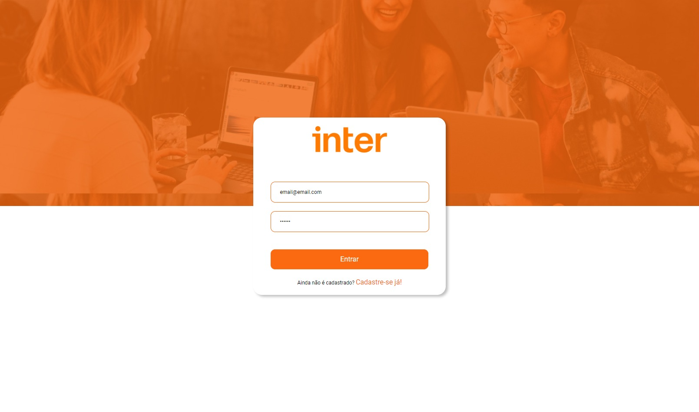

# Frontend App Inter - Semana Front-End Inter/DIO

Criado em plataforma React através do [Create React App](https://github.com/facebook/create-react-app) durante a Semana Front-End do [Banco Inter](https://www.bancointer.com.br) em parceria com a [DIO](https://digitalinnovation.one).

## 📷 Preview

  

  
  

## 📖 Instruções

- Clonar este repositório:

### `git clone https://github.com/volinha/dio-inter-front`

- Abrir a pasta na IDE (ou interpretador de comandos) e executar o comando para instalar os módulos:

### `npm install`

- Executar a aplicação

### `npm start`

Fará a aplicação rodar no seu navegador padrão.\
Caso não abra automaticamente, basta acessar o endereço [http://localhost:3000](http://localhost:3000) para visualizar o projeto.

A página atualizará automaticamente em caso de alterações, também é possível ver erros no console de desenvolvimento.

## 🛠️ Principais Frameworks/IDEs/Libs

- [date-fns](https://date-fns.org)
- [React](https://pt-br.reactjs.org)
- [react-icons](https://react-icons.github.io/react-icons/)
- [React Router DOM](https://v5.reactrouter.com/web/guides/quick-start)
- [Styled Components](https://styled-components.com)
- [TypeScript](https://www.typescriptlang.org)
- [Visual Studio Code](https://code.visualstudio.com)

## Backend App Inter - Semana Front-End Inter/DIO

Disponível em [dio-inter-backend](https://github.com/volinha/dio-inter-backend).

## Projeto Final App Inter - Semana Front-End Inter/DIO

Disponível em [inter-app](https://github.com/volinha/inter-app).

#### 💻 Desenvolvido por Vinícius Fernandes

 
